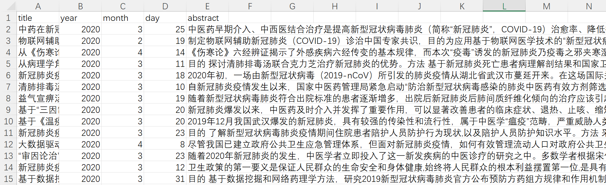
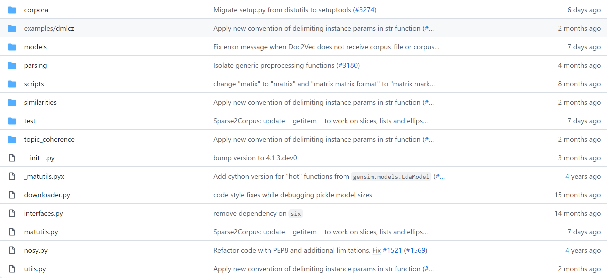
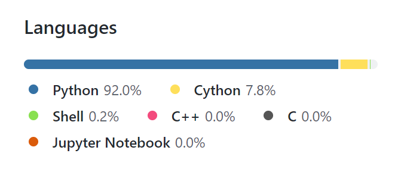

# 个人必做作业2：Gensim/Fasttext学习和使用

2101210676 杨智昊


## 目录

[TOC]

## 任务1：Gensim实现LDA主题模型

### 数据集：新冠病毒科研论文摘要

获取方法：

- 设置检索主题为**“新型冠状病毒”**和**“新冠肺炎”**等相关词汇，基于 Python语言，运用 `Requests`库在**CNKI中国知网**中**爬取**500余篇相关文献。利用 `bs4 `库中的`BeautifulSoup`对象解析文章的发表时间、文献类型和摘要等信息，排除新闻、报纸等类型的文章，并进一步剔除摘要为空的文献，总共得到331篇正式在学术期刊上发表的中文科研论文。
- 相较于标题和关键词，摘要可以更全方位地展现论文的中心思想与调研方法，并且是论文主体部分的人为精简，所以本任务选取摘要作为主要研究对象进行主题建模。
- 爬取到的数据节选展示：




### LDA主题模型

- 隐狄利克雷分布（Latent Dirichlet Allocation, LDA）是一种无监督机器学习技术，具有三层，分别为**文档集层、主题层和特征词层**，每层均由相应的随机变量或参数控制。 LDA 采用贝叶斯估计的方法，假设文档的主题分布和主题特征词分布的先验分布都服从 Dirichlet分布， 需要事先假定所有的文档存在 K个隐含主题再进行建模。
- LDA是一种使用联合分布计算在给定观测变量下隐藏变量的后验分布的概率模型，可以将文档集合中每篇文档的主题以概率分布的形式给出，从而在文档中抽取出它们的主题分布， 随后根据主题进行主题聚类或文本分类。


### 代码实战

- 首先导入所需库

```python
import pandas as pd
from gensim.models import LdaModel
from gensim import corpora
import jieba
```

- 读入新冠病毒相关科研论文的摘要数据

```python
data = pd.read_csv('text.csv', header=None)
abstract_raw = data[4]
abstract_raw = list(abstract_raw)
```

- 将”新型冠状病毒“、”新冠肺炎“等词语加入自己的词典，避免关键词被分词函数分割

```python
jieba.load_userdict('mydict.utf8')
```

- 读入停用词表（也包括标点符号）并对文档进行分词

```python
# 创建停用词列表
def stopwords_list():
    stopwords = [line.strip() for line in open('stopwords.txt', encoding='ansi').readlines()]
    return stopwords


# 对文档进行中文分词
def seg_depart(doc):
    # print("正在分词")
    doc_depart = jieba.cut(doc.strip())
    # 创建一个停用词列表
    stopwords = stopwords_list()
    # 输出结果为outstr
    words = []
    # 去停用词
    for word in doc_depart:
        if word not in stopwords:
            if word != ' ':
                words.append(word)

    return words


abstract = []
for i in range(len(abstract_raw)):
    abstract.append(seg_depart(abstract_raw[i]))
```

- 构造训练数据，并将训练数据中的文本向量化

```python
train_text = abstract[:320]
dictionary = corpora.Dictionary(train_text)
dictionary.filter_n_most_frequent(200)
corpus = [dictionary.doc2bow(text) for text in train_text]
```

- 训练LDA主题模型，需要自己设定划分主题数

```python
lda = LdaModel(corpus=corpus, id2word=dictionary, num_topics=6)
```

- 获取主题词分布

```python
topic_list = lda.print_topics(num_words=20)
for i in topic_list:
    print(i)
```

- 分别输出6个主题中排名前20的主题词

```(0, '0.005*"手术" + 0.004*"门诊" + 0.003*"儿童" + 0.003*"人数" + 0.002*"确诊患者" + 0.002*"交叉感染" + 0.002*"服务" + 0.002*"参与" + 0.002*"暴露" + 0.002*"史" + 0.002*"证候" + 0.002*"湖北" + 0.002*"死亡" + 0.002*"就诊" + 0.002*"处方" + 0.002*"最新" + 0.002*"传变" + 0.002*"口罩" + 0.002*"培训" + 0.002*"一线"')
(0, '0.008*"手术" + 0.006*"标本" + 0.004*"密切接触者" + 0.003*"咽拭子" + 0.003*"门诊" + 0.003*"采集" + 0.003*"焦虑" + 0.003*"接触" + 0.003*"阳性" + 0.003*"组" + 0.002*"技术" + 0.002*"抑郁" + 0.002*"手术室" + 0.002*"痰" + 0.002*"肺证" + 0.002*"防疫" + 0.002*"护理" + 0.002*"处置" + 0.002*"水平" + 0.002*"专利"')
(1, '0.005*"抗体" + 0.004*"IgG" + 0.004*"IgM" + 0.004*"康复" + 0.004*"组" + 0.003*"阴性" + 0.003*"人数" + 0.003*"血清" + 0.002*"样本" + 0.002*"儿童" + 0.002*"济南市" + 0.002*"史" + 0.002*"特异性" + 0.002*"医学" + 0.002*"标本" + 0.002*"阳性" + 0.002*"CRP" + 0.002*"教育" + 0.002*"中位数" + 0.002*"确诊患者"')
(2, '0.004*"靶点" + 0.003*"知识" + 0.003*"一线" + 0.003*"炎症" + 0.003*"网络" + 0.003*"医护人员" + 0.003*"支持" + 0.002*"技术" + 0.002*"水平" + 0.002*"风暴" + 0.002*"痰" + 0.002*"通路" + 0.002*"健康状况" + 0.002*"处方" + 0.002*"42" + 0.002*"儿童" + 0.002*"焦虑" + 0.002*"生物" + 0.002*"全球" + 0.002*"毒"')
(3, '0.004*"密切接触者" + 0.003*"影像学" + 0.003*"组" + 0.003*"炎症" + 0.003*"焦虑" + 0.002*"PICC" + 0.002*"C" + 0.002*"A" + 0.002*"肺部" + 0.002*"清肺" + 0.002*"门诊" + 0.002*"联合" + 0.002*"接触" + 0.002*"d" + 0.002*"寒湿" + 0.002*"儿童" + 0.002*"排毒" + 0.002*"湖北" + 0.002*"B" + 0.002*"靶点"')
(4, '0.006*"中成药" + 0.005*"注射液" + 0.003*"肿瘤" + 0.003*"试剂" + 0.002*"快速" + 0.002*"手术" + 0.002*"颗粒" + 0.002*"处方" + 0.002*"医疗" + 0.002*"推荐" + 0.002*"平台" + 0.002*"性" + 0.002*"驻地" + 0.002*"情绪" + 0.002*"参与" + 0.002*"经济" + 0.002*"复方" + 0.002*"合并" + 0.002*"传变" + 0.002*"统计"')
(5, '0.005*"通路" + 0.004*"靶点" + 0.004*"患儿" + 0.003*"住院" + 0.003*"护士" + 0.003*"居家" + 0.003*"培训" + 0.002*"信号" + 0.002*"企业" + 0.002*"化合物" + 0.002*"医德" + 0.002*"口罩" + 0.002*"入院" + 0.002*"儿童" + 0.002*"活性" + 0.002*"危重型" + 0.002*"疫病" + 0.002*"复工" + 0.002*"护理" + 0.002*"呼吸"')
```

- 可以根据主题词来推断文档的主题。比如，在主题4中的主题词中，”中医药“、”颗粒“、”复方“等与中医药相关的词居多，可以认为主题2为**中医治疗**主题。

- 对于一篇新论文的摘要，我们同样可以将其转化为词袋向量，喂给训练好的LDA模型，让模型输出新文档的主题分布。

```python
# 获取一篇新文档的主题
new_text = abstract[-1]
doc_bow = dictionary.doc2bow(new_text)
doc_lda = lda[doc_bow]
print(abstract_raw[-1])
print(doc_lda)
```

- 结果输出

> 新文档：
>
> 目的 构建中医药治疗新型冠状病毒肺炎疗效评价标准。方法 检索中医药治疗新型冠状病毒肺炎的相关文献,提取其中临床疗效评价信息;对所承担武汉市金银潭医院、武汉市将军路街卫生院救治任务所获得的临床数据进行分析,获取可用于中医药疗效评价的指标。结合文献报道与临床资料筛选出中医药治疗新型冠状病毒肺炎的疗效评价指标,并根据其反映机体恢复的能力大小,结合专家意见设置相应的权重等信息,提出中医药治疗新型冠状病毒肺炎疗效评价指标的遴选原则,并进行疗效评价指标筛选。结果 综合文献与临床资料分析,能够较好反映经过中医药治疗后机体功能恢复的有发热、咳嗽、呼吸急促、乏力、纳差、恶心、胸闷、舌苔等主要证候指标,指氧饱和度(%)、淋巴细胞计数(LY)、淋巴细胞百分比(LY%)、中性粒细胞计数(NEUT)、中性粒细胞百分比(NEUT%)、C反应蛋白(CRP)、肌酸激酶(CK)、肌酸激酶同工酶(CK-MB)、乳酸脱氢酶(LDH)等理化指标及胸部影像学检查,认为以上指标可作为中医药治疗新型冠状病毒肺炎疗效的评价指标。结论 设计完成了中医药治疗新型冠状病毒肺炎疗效评价量表,构建了疗效评价指标体系及结果判定标准。该标准的构建将有利于后续中医药临床数据的收集,可为科学评价中医药在治疗新冠肺炎中的作用与优势提供依据。

```[(2, 0.2889976), (3, 0.17769277), (4, 0.41134414), (5, 0.11669039)]```

- 可以认为，该新论文的摘要属于主题4，与中医药治疗有关。


## 任务2：使用Gensim训练Word2Vec模型

### 数据集：中文新闻标题数据集

中文新闻标题数据集包含32种类型的新闻标题47,850个。

> 链接：[sample_data.tar.gz_免费高速下载|百度网盘-分享无限制 (baidu.com)](


### 代码实战

- 导入所需库

```python
from gensim.models import word2vec
import pandas as pd
import logging
import jieba
```

- 读入新闻标题数据，并将每个标题存入列表

```python
data = pd.read_csv("train_file.txt", sep="\t", encoding='utf8', header=None)
print(data.head())
sentence = list(data[1])
```

- 借助```jieba```库对文本进行分词，并剔除停用词和各种标点符号

```python
# 创建停用词列表
def stopwords_list():
    stopwords = [line.strip() for line in open('stopwords.txt', encoding='ansi').readlines()]
    return stopwords


# 对文档进行中文分词
def seg_depart(doc):
    # print("正在分词")
    doc_depart = jieba.cut(doc.strip())
    # 创建一个停用词列表
    stopwords = stopwords_list()
    # 输出结果为outstr
    words = []
    # 去停用词
    for word in doc_depart:
        if word not in stopwords:
            if word != ' ':
                words.append(word)

    return words


sentence_words = []
for i in range(len(sentence)):
    if type(sentence[i]) is not float:
        sentence_words.append(seg_depart(sentence[i]))
```

- 使用```CBOW```模型训练`Word2Vec`，即通过周围词预测中心词的方式训练词向量

```python
logging.basicConfig(format='%(asctime)s : %(levelname)s : %(message)s', level=logging.INFO)
model = word2vec.Word2Vec(sentence_words, min_count=10, sg=0, epochs=20)
model.save("word2vec.model")
```

- 训练过程展示如下

```
2021-12-10 17:11:10,243 : INFO : collecting all words and their counts
2021-12-10 17:11:10,243 : INFO : PROGRESS: at sentence #0, processed 0 words, keeping 0 word types
2021-12-10 17:11:10,259 : INFO : PROGRESS: at sentence #10000, processed 71248 words, keeping 25341 word types
2021-12-10 17:11:10,276 : INFO : PROGRESS: at sentence #20000, processed 142835 words, keeping 39122 word types
2021-12-10 17:11:10,294 : INFO : PROGRESS: at sentence #30000, processed 214051 words, keeping 49787 word types
2021-12-10 17:11:10,311 : INFO : PROGRESS: at sentence #40000, processed 285238 words, keeping 58757 word types
2021-12-10 17:11:10,325 : INFO : collected 65073 word types from a corpus of 341713 raw words and 47950 sentences
2021-12-10 17:11:10,325 : INFO : Creating a fresh vocabulary
2021-12-10 17:11:10,364 : INFO : Word2Vec lifecycle event {'msg': 'effective_min_count=10 retains 6067 unique words (9.323375286217018%% of original 65073, drops 59006)', 'datetime': '2021-12-10T17:11:10.363843', 'gensim': '4.1.2', 'python': '3.8.8 (default, Apr 13 2021, 15:08:03) [MSC v.1916 64 bit (AMD64)]', 'platform': 'Windows-10-10.0.22000-SP0', 'event': 'prepare_vocab'}
2021-12-10 17:11:10,364 : INFO : Word2Vec lifecycle event {'msg': 'effective_min_count=10 leaves 223954 word corpus (65.53862451823606%% of original 341713, drops 117759)', 'datetime': '2021-12-10T17:11:10.364837', 'gensim': '4.1.2', 'python': '3.8.8 (default, Apr 13 2021, 15:08:03) [MSC v.1916 64 bit (AMD64)]', 'platform': 'Windows-10-10.0.22000-SP0', 'event': 'prepare_vocab'}
2021-12-10 17:11:10,393 : INFO : deleting the raw counts dictionary of 65073 items
2021-12-10 17:11:10,394 : INFO : sample=0.001 downsamples 18 most-common words
2021-12-10 17:11:10,394 : INFO : Word2Vec lifecycle event {'msg': 'downsampling leaves estimated 218998.35920632991 word corpus (97.8%% of prior 223954)', 'datetime': '2021-12-10T17:11:10.394843', 'gensim': '4.1.2', 'python': '3.8.8 (default, Apr 13 2021, 15:08:03) [MSC v.1916 64 bit (AMD64)]', 'platform': 'Windows-10-10.0.22000-SP0', 'event': 'prepare_vocab'}
2021-12-10 17:11:10,446 : INFO : estimated required memory for 6067 words and 100 dimensions: 7887100 bytes
2021-12-10 17:11:10,446 : INFO : resetting layer weights
2021-12-10 17:11:10,448 : INFO : Word2Vec lifecycle event {'update': False, 'trim_rule': 'None', 'datetime': '2021-12-10T17:11:10.448414', 'gensim': '4.1.2', 'python': '3.8.8 (default, Apr 13 2021, 15:08:03) [MSC v.1916 64 bit (AMD64)]', 'platform': 'Windows-10-10.0.22000-SP0', 'event': 'build_vocab'}
2021-12-10 17:11:10,449 : INFO : Word2Vec lifecycle event {'msg': 'training model with 3 workers on 6067 vocabulary and 100 features, using sg=0 hs=0 sample=0.001 negative=5 window=5 shrink_windows=True', 'datetime': '2021-12-10T17:11:10.449414', 'gensim': '4.1.2', 'python': '3.8.8 (default, Apr 13 2021, 15:08:03) [MSC v.1916 64 bit (AMD64)]', 'platform': 'Windows-10-10.0.22000-SP0', 'event': 'train'}
2021-12-10 17:11:10,602 : INFO : worker thread finished; awaiting finish of 2 more threads
2021-12-10 17:11:10,603 : INFO : worker thread finished; awaiting finish of 1 more threads
2021-12-10 17:11:10,606 : INFO : worker thread finished; awaiting finish of 0 more threads
2021-12-10 17:11:10,606 : INFO : EPOCH - 1 : training on 341713 raw words (218956 effective words) took 0.1s, 1479564 effective words/s
2021-12-10 17:11:10,762 : INFO : worker thread finished; awaiting finish of 2 more threads
2021-12-10 17:11:10,762 : INFO : worker thread finished; awaiting finish of 1 more threads
2021-12-10 17:11:10,764 : INFO : worker thread finished; awaiting finish of 0 more threads
2021-12-10 17:11:10,764 : INFO : EPOCH - 2 : training on 341713 raw words (219051 effective words) took 0.2s, 1448693 effective words/s
2021-12-10 17:11:10,912 : INFO : worker thread finished; awaiting finish of 2 more threads
2021-12-10 17:11:10,913 : INFO : worker thread finished; awaiting finish of 1 more threads
2021-12-10 17:11:10,913 : INFO : worker thread finished; awaiting finish of 0 more threads
2021-12-10 17:11:10,913 : INFO : EPOCH - 3 : training on 341713 raw words (219001 effective words) took 0.1s, 1545109 effective words/s
2021-12-10 17:11:11,058 : INFO : worker thread finished; awaiting finish of 2 more threads
2021-12-10 17:11:11,059 : INFO : worker thread finished; awaiting finish of 1 more threads
2021-12-10 17:11:11,060 : INFO : worker thread finished; awaiting finish of 0 more threads
2021-12-10 17:11:11,060 : INFO : EPOCH - 4 : training on 341713 raw words (218991 effective words) took 0.1s, 1585400 effective words/s
2021-12-10 17:11:11,206 : INFO : worker thread finished; awaiting finish of 2 more threads
2021-12-10 17:11:11,207 : INFO : worker thread finished; awaiting finish of 1 more threads
2021-12-10 17:11:11,211 : INFO : worker thread finished; awaiting finish of 0 more threads
2021-12-10 17:11:11,211 : INFO : EPOCH - 5 : training on 341713 raw words (219044 effective words) took 0.1s, 1570216 effective words/s
2021-12-10 17:11:11,373 : INFO : worker thread finished; awaiting finish of 2 more threads
2021-12-10 17:11:11,375 : INFO : worker thread finished; awaiting finish of 1 more threads
2021-12-10 17:11:11,379 : INFO : worker thread finished; awaiting finish of 0 more threads
2021-12-10 17:11:11,379 : INFO : EPOCH - 6 : training on 341713 raw words (218967 effective words) took 0.2s, 1371053 effective words/s
2021-12-10 17:11:11,527 : INFO : worker thread finished; awaiting finish of 2 more threads
2021-12-10 17:11:11,529 : INFO : worker thread finished; awaiting finish of 1 more threads
2021-12-10 17:11:11,531 : INFO : worker thread finished; awaiting finish of 0 more threads
2021-12-10 17:11:11,531 : INFO : EPOCH - 7 : training on 341713 raw words (219050 effective words) took 0.1s, 1517724 effective words/s
2021-12-10 17:11:11,674 : INFO : worker thread finished; awaiting finish of 2 more threads
2021-12-10 17:11:11,678 : INFO : worker thread finished; awaiting finish of 1 more threads
2021-12-10 17:11:11,679 : INFO : worker thread finished; awaiting finish of 0 more threads
2021-12-10 17:11:11,679 : INFO : EPOCH - 8 : training on 341713 raw words (219000 effective words) took 0.1s, 1568127 effective words/s
2021-12-10 17:11:11,821 : INFO : worker thread finished; awaiting finish of 2 more threads
2021-12-10 17:11:11,824 : INFO : worker thread finished; awaiting finish of 1 more threads
2021-12-10 17:11:11,827 : INFO : worker thread finished; awaiting finish of 0 more threads
2021-12-10 17:11:11,827 : INFO : EPOCH - 9 : training on 341713 raw words (218972 effective words) took 0.1s, 1563130 effective words/s
2021-12-10 17:11:11,973 : INFO : worker thread finished; awaiting finish of 2 more threads
2021-12-10 17:11:11,974 : INFO : worker thread finished; awaiting finish of 1 more threads
2021-12-10 17:11:11,980 : INFO : worker thread finished; awaiting finish of 0 more threads
2021-12-10 17:11:11,980 : INFO : EPOCH - 10 : training on 341713 raw words (218967 effective words) took 0.1s, 1530290 effective words/s
2021-12-10 17:11:12,135 : INFO : worker thread finished; awaiting finish of 2 more threads
2021-12-10 17:11:12,136 : INFO : worker thread finished; awaiting finish of 1 more threads
2021-12-10 17:11:12,140 : INFO : worker thread finished; awaiting finish of 0 more threads
2021-12-10 17:11:12,140 : INFO : EPOCH - 11 : training on 341713 raw words (218995 effective words) took 0.1s, 1478716 effective words/s
2021-12-10 17:11:12,284 : INFO : worker thread finished; awaiting finish of 2 more threads
2021-12-10 17:11:12,285 : INFO : worker thread finished; awaiting finish of 1 more threads
2021-12-10 17:11:12,287 : INFO : worker thread finished; awaiting finish of 0 more threads
2021-12-10 17:11:12,287 : INFO : EPOCH - 12 : training on 341713 raw words (219000 effective words) took 0.1s, 1566562 effective words/s
2021-12-10 17:11:12,453 : INFO : worker thread finished; awaiting finish of 2 more threads
2021-12-10 17:11:12,455 : INFO : worker thread finished; awaiting finish of 1 more threads
2021-12-10 17:11:12,457 : INFO : worker thread finished; awaiting finish of 0 more threads
2021-12-10 17:11:12,457 : INFO : EPOCH - 13 : training on 341713 raw words (218964 effective words) took 0.2s, 1360258 effective words/s
2021-12-10 17:11:12,596 : INFO : worker thread finished; awaiting finish of 2 more threads
2021-12-10 17:11:12,599 : INFO : worker thread finished; awaiting finish of 1 more threads
2021-12-10 17:11:12,601 : INFO : worker thread finished; awaiting finish of 0 more threads
2021-12-10 17:11:12,601 : INFO : EPOCH - 14 : training on 341713 raw words (219060 effective words) took 0.1s, 1612855 effective words/s
2021-12-10 17:11:12,746 : INFO : worker thread finished; awaiting finish of 2 more threads
2021-12-10 17:11:12,747 : INFO : worker thread finished; awaiting finish of 1 more threads
2021-12-10 17:11:12,750 : INFO : worker thread finished; awaiting finish of 0 more threads
2021-12-10 17:11:12,750 : INFO : EPOCH - 15 : training on 341713 raw words (219053 effective words) took 0.1s, 1540868 effective words/s
2021-12-10 17:11:12,895 : INFO : worker thread finished; awaiting finish of 2 more threads
2021-12-10 17:11:12,896 : INFO : worker thread finished; awaiting finish of 1 more threads
2021-12-10 17:11:12,898 : INFO : worker thread finished; awaiting finish of 0 more threads
2021-12-10 17:11:12,898 : INFO : EPOCH - 16 : training on 341713 raw words (218992 effective words) took 0.1s, 1566082 effective words/s
2021-12-10 17:11:13,044 : INFO : worker thread finished; awaiting finish of 2 more threads
2021-12-10 17:11:13,044 : INFO : worker thread finished; awaiting finish of 1 more threads
2021-12-10 17:11:13,045 : INFO : worker thread finished; awaiting finish of 0 more threads
2021-12-10 17:11:13,045 : INFO : EPOCH - 17 : training on 341713 raw words (219003 effective words) took 0.1s, 1569347 effective words/s
2021-12-10 17:11:13,193 : INFO : worker thread finished; awaiting finish of 2 more threads
2021-12-10 17:11:13,196 : INFO : worker thread finished; awaiting finish of 1 more threads
2021-12-10 17:11:13,198 : INFO : worker thread finished; awaiting finish of 0 more threads
2021-12-10 17:11:13,198 : INFO : EPOCH - 18 : training on 341713 raw words (218944 effective words) took 0.1s, 1513277 effective words/s
2021-12-10 17:11:13,341 : INFO : worker thread finished; awaiting finish of 2 more threads
2021-12-10 17:11:13,342 : INFO : worker thread finished; awaiting finish of 1 more threads
2021-12-10 17:11:13,344 : INFO : worker thread finished; awaiting finish of 0 more threads
2021-12-10 17:11:13,344 : INFO : EPOCH - 19 : training on 341713 raw words (219094 effective words) took 0.1s, 1583808 effective words/s
2021-12-10 17:11:13,492 : INFO : worker thread finished; awaiting finish of 2 more threads
2021-12-10 17:11:13,494 : INFO : worker thread finished; awaiting finish of 1 more threads
2021-12-10 17:11:13,497 : INFO : worker thread finished; awaiting finish of 0 more threads
2021-12-10 17:11:13,497 : INFO : EPOCH - 20 : training on 341713 raw words (218942 effective words) took 0.1s, 1525478 effective words/s
2021-12-10 17:11:13,497 : INFO : Word2Vec lifecycle event {'msg': 'training on 6834260 raw words (4380046 effective words) took 3.0s, 1436728 effective words/s', 'datetime': '2021-12-10T17:11:13.497276', 'gensim': '4.1.2', 'python': '3.8.8 (default, Apr 13 2021, 15:08:03) [MSC v.1916 64 bit (AMD64)]', 'platform': 'Windows-10-10.0.22000-SP0', 'event': 'train'}
2021-12-10 17:11:13,498 : INFO : Word2Vec lifecycle event {'params': 'Word2Vec(vocab=6067, vector_size=100, alpha=0.025)', 'datetime': '2021-12-10T17:11:13.498275', 'gensim': '4.1.2', 'python': '3.8.8 (default, Apr 13 2021, 15:08:03) [MSC v.1916 64 bit (AMD64)]', 'platform': 'Windows-10-10.0.22000-SP0', 'event': 'created'}
2021-12-10 17:11:13,498 : INFO : Word2Vec lifecycle event {'fname_or_handle': 'word2vec.model', 'separately': 'None', 'sep_limit': 10485760, 'ignore': frozenset(), 'datetime': '2021-12-10T17:11:13.498275', 'gensim': '4.1.2', 'python': '3.8.8 (default, Apr 13 2021, 15:08:03) [MSC v.1916 64 bit (AMD64)]', 'platform': 'Windows-10-10.0.22000-SP0', 'event': 'saving'}
2021-12-10 17:11:13,498 : INFO : not storing attribute cum_table
2021-12-10 17:11:13,509 : INFO : saved word2vec.model
```

- 基于训练好的模型进行测试，比如计算与“期货”相似度最高的词语

```python
# 测试
for i in model.wv.most_similar(u"期货"):
    print(i[0], i[1])
```

- 得到输出结果

```
银 0.9150055646896362
成品油 0.9064344763755798
白银 0.9060271978378296
交易 0.8979558348655701
反弹 0.897598385810852
震荡 0.8962752223014832
主力 0.8926511406898499
调价 0.8879452347755432
龙头 0.8846691250801086
行情 0.8810186982154846
```


## 任务3：使用FastText实现文本多分类

### 数据集：新闻文本数据集（天池竞赛）

> 链接：[数据集-阿里云天池 (aliyun.com)](https://tianchi.aliyun.com/dataset/dataDetail?dataId=114544#1)

数据集已经经过分词和打标处理，总共14个类别。

- 训练集：200595条新闻文本及所属label；
- 测试集：50172条无标签新闻文本。


### FastText模型简介

> 论文：Bag of Tricks for Efficient Text Classification
>
> 链接：[1607.01759.pdf (arxiv.org)](https://arxiv.org/pdf/1607.01759.pdf)
>
> 代码：https://github.com/facebookresearch/fastText


上图是论文中模型的架构，其模型输入 = 句子本身 + n-gram额外特征。这样做，一方面引入了更多字符特征，另一方面解决了词顺序的问题。

由于每个句子的长度不同，为了便于建模，需要把每个句子填充到相同的长度。如果只使用常见的10000的词（数据预处理后），我们需要把它映射到2-10002之间的整数索引，其中1是留给未登录词，0是用来填充长度。此外，如果数据量很大且句子较长，会引起n-gram数据组合爆炸的问题，原论文中通过采用**hash映射**到1到K之间来解决这个问题，同时为了避免和前面的汉字索引出现冲突，哈希映射值一般会加上最大长度的值，即映射到10003-10003+k之间。所以模型的输入长度 = 句子填充长度 + 哈希映射值 = 10003 + k。

数据转换索引后，模型会经过Embedding层，将索引映射为稠密向量。

参考下面Keras官方实现的fasttext的文本分类文档，给出模型求平均的方法

```python3
model = Sequential()

# 从有效的嵌入层开始，该层将 vocab 索引映射到 embedding_dims 维度
model.add(Embedding(max_features,
                    embedding_dims,
                    input_length=maxlen))

# 添加 GlobalAveragePooling1D，它将对文档中所有单词执行平均嵌入
model.add(GlobalAveragePooling1D())

# 投影到单个单位输出层上，并用 sigmoid 压扁它：
model.add(Dense(1, activation='sigmoid'))

model.compile(loss='binary_crossentropy',
              optimizer='adam',
              metrics=['accuracy'])
```

这里采用了`GlobalAveragePooling1D()`来对所有文档执行嵌入，它会把所有词的Embedding向量求平均得到一个均值向量。

在模型优化上，FastText主要采用了两种加速训练的方法：

- **层次softmax**

  主要是用来解决文本类别比较多时，使用softmax计算会使计算复杂度很高，大概是O(kh)，其中k是文本类别树，h是embedding维度。而层次softmax采用哈夫曼树的方式来把复杂度降低到O(hlog2k)，大大加快了训练速度。

- **哈希函数**

  为了节省内存和n-gram组合爆炸的问题，fasttext把n-gram数据构成一个词典，并通过哈希函数映成整数（索引）至1到K，理论上哈希到同一个位置的不同n-gram应该共享索引和Embedding。


### 代码实战

注意：

Facebook使用C++进行实现，进一步提升了计算效率。**因此，在安装fastfext库之前，本机必须安装`Microsoft C++ Build Tools`，不然会报错，无法成功安装。**

> 这里给出下载链接：[Microsoft C++ 生成工具 - Visual Studio](https://visualstudio.microsoft.com/zh-hans/visual-cpp-build-tools/)

当然，也可以直接使用`gensim`库中的fasttext实现。

- 首先导入所需库：

```python
import fasttext
import pandas as pd
from sklearn.utils import shuffle
```

- 定义数据处理类

```python
class DataProcess(object):

    def load_data(self):
        df_train = pd.read_csv('train_set.csv', sep='\t')

        # 对类别加上 "__label__"前缀
        df_train['label_ft'] = '__label__' + df_train['label'].astype(str)

        df_train[['text', 'label_ft']].iloc[:195000].to_csv('train.csv', index=None, header=None, sep='\t')

        return df_train

    def split_data(self, df_train):
        # 打乱数据集
        df_train = shuffle(df_train)

        # 训练集
        train_data = df_train[['text', 'label_ft']].iloc[:195000]
        train_data.to_csv('train.csv', index=None, header=None, sep='\t')

        # 挑选5000条数据作为验证集
        validate_data = df_train[['text', 'label_ft']].iloc[-5000:]
        validate_data.to_csv('validate.csv', index=None, header=None, sep='\t')
```

- 定义模型类
  - 超参数设置
  - 计算验证集表现
  - 定义测试函数

```python
class FastTextModel(object):

    def __init__(self, ):
        pass

    def train(self):
        model = fasttext.train_supervised(input='train.csv',
                                          label_prefix="__label__",
                                          epoch=30,
                                          dim=32,
                                          lr=0.1,
                                          loss='softmax',
                                          word_ngrams=3,
                                          min_count=2,
                                          bucket=1000000)

        return model

    def save_model(self, model):
        model.save_model("fasttext.bin")

    def load_model(self):
        model = fasttext.load_model("fasttext.bin")

        return model

    # 预测验证集结果
    def test(self):
        model = self.load_model()
        score = model.test("validate.csv")
        precision = score[1]
        recall = score[2]
        f1_score = round(2 * (precision * recall) / (precision + recall), 2)

        print("验证集评测结果：Precision:{}, Recall:{}, F1-score:{}".format(precision, recall, f1_score))

    # 预测5万条测试数据的结果
    def predict_testA(self):
        df_testA = pd.read_csv("test_a.csv")
        test_data = df_testA["text"].values.tolist()

        model = self.load_model()
        res = model.predict(test_data)

        predict_res = [y_[0].replace("__label__", "") for y_ in res[0]]
        print(predict_res)
        predict_label = pd.Series(predict_res, name="label")
        predict_label.to_csv("predict_label.csv", index=False)
```

- main函数

```python
if __name__ == '__main__':

    data_process = DataProcess()
    fasttext_model = FastTextModel()
    df_train = data_process.load_data()
    data_process.split_data(df_train)
    model = fasttext_model.train()
    fasttext_model.save_model(model)
    fasttext_model.test()
    fasttext_model.predict_testA()
```

- 训练过程

```
Read 177M words
Number of words:  6496
Number of labels: 14
Progress:   5.4% words/sec/thread:  786461 lr:  0.094625 avg.loss:  0.821507 ETA:   0h15m14s
```

- 训练完成

```Read 177M words
Progress: 100.0% words/sec/thread:  778062 lr:  0.000000 avg.loss:  0.157514 ETA:   0h 0m 0s
```

- 在验证集上的评测结果

```
验证集评测结果：Precision:0.9446, Recall:0.9446, F1-score:0.94
```

- 在测试集上进行测试

  节选分类结果展示如下：

```
['1', '2', '8', '5', '0', '4', '2', '1', '6', '5', '1', '0', '3', '6', '0', '1', '2', '1', '7', '0', '2', '5', '7', '6', '2', '5', '1', '2', '2', '6', '0', '7', '1', '1', '6', '0', '3', '9', '7', '3', '5', '2', '1', '2', '0', '1', '0', '2', '2', '0', '5', '2', '3', '1', '0', '7', '6', '7', '0', '3', '5', '3', '0', '6', '2', '13', '1', '0', '2', '2', '6', '1', '4', '4', '0', '2', '2', '2', '3', '0', '10', '8', '1', '4', '9', '1', '1', '10', '3', '0', '9', '1', '1', '8', '3', '7', '10', '10', '3', '0', '2', 
```


## Gensim文件结构分析

> Gensim官方网站：[Gensim: Topic modelling for humans (radimrehurek.com)](https://radimrehurek.com/gensim/index.html)
>
> Gensim源码地址：[RaRe-Technologies/gensim: Topic Modelling for Humans (github.com)](https://github.com/RaRe-Technologies/gensim/#documentation)



可以看到，Gensim这个开源库一直在更新~~

Gensim的主要模块包括`model`（模型）和`corpora`（语料库）等

- `models`模块囊括了一些从原始词袋计数中提取文档表示的算法，包括`doc2vec`, `fasttext`, `LDA`, `TF-IDF`, `word2vec`等等NLP中的主流模型，供用户直接调用；
- `corpora`模块包含各种流语料库I/O格式的实现，包括我们最常用的`dictionary.py`，以及用于构建语料库的`textcorpus.py`, `wikicorpus.py`等文件；
- `scripts`模块主要包括`make_wiki***.py`，将文章从Wikipedia转储（XML格式）转换为（稀疏）向量；
- `parsing`模块主要实现字符串预处理的一些功能；
- `similarities`模块包含成对相似度查询的实现；
- `test`模块包含所有其他gensim包的自动代码测试；
- `topic_coherence`包含主题一致性pipeline的单个组件的实现。


## 知识结构和技能的欠缺

- 可以看到，Gensim源代码中92%由Python编写，并且通过阅读源码，认为自己还是要继续学习Python更进阶的用法，才能更好的理解别人的巧妙设计。



- 同时，Gensim在后台执行了高度优化的Fortran/C，大大提高了运行速度和内存效率。因此，为了系统剖析这一块的功能实现，需要学习**Cython**，将一部分核心逻辑用C语言实现，或者让Python能够调用一个C语言实现的系统，以提升整体性能

- 此外，还需学习运行Python文件时的一些参数设计等。
